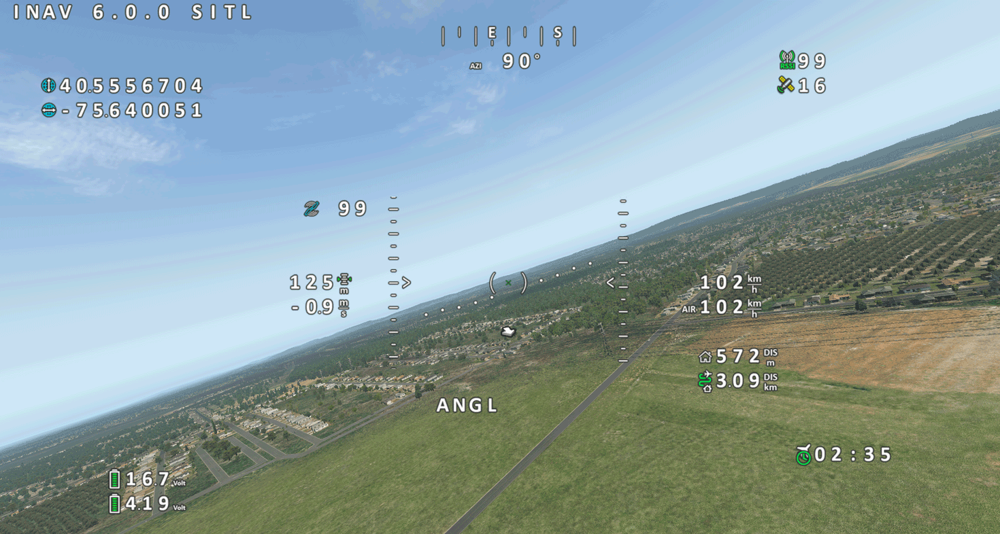

# INAV SIM OSD

PC OSD for INAV SITL/HITL



You may need to install the .NET Desktop Runtime 7 (latest version): https://dotnet.microsoft.com/en-us/download/dotnet/7.0

For INAV >= 6.0, set the following option in the CLI:

```set osd_msp_displayport_fullframe_interval = -1```

otherwise the OSD is only displayed incompletely.

## SITL
Configure a MSP-Displayport on any UART and connect via TCP to localhost (127.0.0.1) and the corresponding TCP port.
See INAV SITL documentaion for more details.

## HITL
Configure a MSP-Displayport on any UART and connect via UART to USB module and select corresponding COM-Port.

## Font
The HD fonts from DJI WTFOS are used. New or updated fonts can simply be placed in a new subfolder in "osd_font".

Select "DJIWTF" as video format in INAV.

## Supported Simulators:
- RealFlight
- XPlane

## Known issues
- Works only if simulator is in window mode (No fullscreen)
- ~~OSD stick menu isn't working (will be fixed soon)~~ Works in INAV >= 6.1, was a bug in INAV
